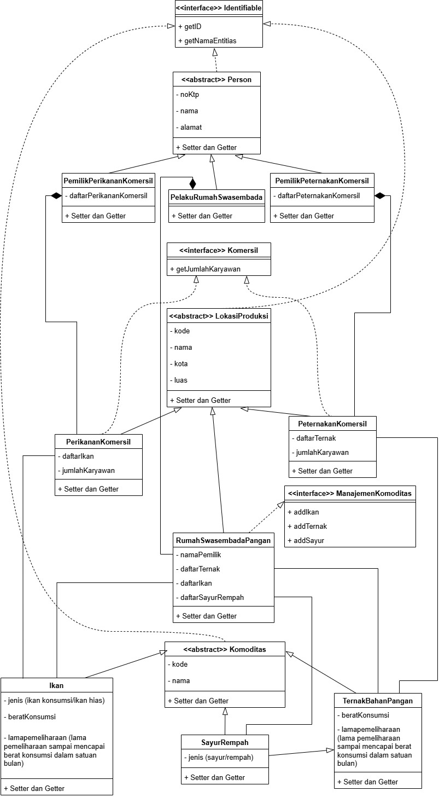

## Janji

Saya **Muhammad ‘Azmi Salam** dengan **NIM 2406010** mengerjakan soal **UTS** dalam mata kuliah **Desain Pemrograman Berorientasi Objek (DPBO)** untuk keberkahan-Nya maka saya **tidak melakukan kecurangan** seperti yang telah dispesifikasikan. Aamiin.

---

## Diagram 

**Mahzab desain yang digunakan:**
1. **Inheritance (Extends):** Panah kosong, garis padat
2. **Composition:** Belah ketupat penuh, garis padat
3. **Aggregation:** Belah ketupat kosong, garis padat
4. **Association:** Garis padat tanpa kepala
5. **Interface (Implements):** Panah Kosong, garis putus-putus

  
  

---

## Penjelasan dan Alasan

### 1. Fondasi Hierarki (Kelas Abstrak & Interface)
Sistem ini dibangun di atas tiga *abstract class* dan tiga *interface* yang berfungsi sebagai kontrak dan kerangka dasar.

* **a. Interface Identifiable**
    Ini adalah kontrak fundamental yang diterapkan oleh semua entitas utama dalam sistem (`Person`, `Lokasi Produksi`, dan `Komoditas`). Tujuannya adalah memastikan bahwa setiap objek memiliki cara standar untuk mendapatkan identitas unik (`getID()`) dan nama utama (`getNamaEntitas()`), memfasilitasi penggunaan Polimorfisme pada array data pencarian.

* **b. Abstract Class Person**
    Kelas ini adalah *superclass* utama untuk semua individu, menyimpan atribut dasar seperti `noKtp`, `nama`, dan `alamat`. Adanya kelas abstrak ini menjamin konsistensi data identitas melalui *Inheritance* untuk semua peran manusia.

* **c. Abstract Class Lokasi Produksi**
    Kelas ini berfungsi sebagai *superclass* untuk semua tempat fisik di mana kegiatan produksi (pertanian, perikanan, peternakan) dilakukan. Atribut yang diwariskan oleh semua lokasi meliputi `kode`, `nama`, `kota`, dan `luas`.

* **d. Abstract Class Komoditas**
    Kelas ini adalah *superclass* untuk semua hasil produksi biologis yang dikelola, mencakup ternak, ikan, dan sayuran. Kelas ini menyimpan atribut dasar `kode` dan `nama`. Kelas ini sengaja dibuat umum untuk mengakomodasi entitas non-pangan (seperti ikan hias) tanpa memerlukan hierarki tambahan.

* **e. Interface Komersil**
    Kontrak ini mendefinisikan perilaku bisnis/operasional komersial, yang spesifiknya adalah memiliki dan melaporkan `getJumlahKaryawan()`. Interface ini hanya diterapkan oleh `PerikananKomersil` dan `PeternakanKomersil`.

* **f. Interface Manajemen Komoditas**
    Kontrak ini mendefinisikan kemampuan untuk mengelola tiga jenis komoditas berbeda (`addIkan`, `addTernak`, `addSayur`). Interface ini diterapkan oleh `RumahSwasembadaPangan` untuk menunjukkan sifatnya sebagai unit produksi yang serba ada.

### 2. Kelas Peran Manusia dan Relasinya
Semua kelas peran manusia mewarisi dari `Person`.

* **a. Kelas Pelaku RumahSwasembada**
    Kelas ini mewakili individu yang mengelola lokasi Swasembada Pangan. Ia memiliki **Asosiasi** (hubungan lemah) dengan objek `RumahSwasembadaPangan` yang mereka kelola.

* **b. Kelas Pemilik Perikanan Komersil dan Pemilik Peternakan Komersil**
    Kedua kelas ini mewakili pemilik bisnis komersil. Mereka memiliki relasi **Komposisi** (Kepemilikan Kuat) ke objek lokasi komersil masing-masing (`daftarPerikananKomersil`/`daftarPeternakanKomersil`). Relasi ini menyiratkan bahwa lokasi komersil tidak dapat ada dalam sistem tanpa adanya pemilik yang mencatatnya.

### 3. Kelas Spesialisasi Lokasi Produksi
Semua kelas lokasi mewarisi dari `Lokasi Produksi`.

* **a. Kelas Perikanan Komersil**
    Kelas ini mengimplementasikan `Komersil` dan memiliki atribut `jumlahKaryawan` serta `daftarIkan`. Hubungan dengan `Ikan` adalah **Asosiasi** (garis padat tanpa kepala), mengakui bahwa ikan yang dicatat masih bisa eksis di luar lokasi komersil tersebut.

* **b. Kelas Peternakan Komersil**
    Kelas ini juga mengimplementasikan `Komersil` dan memiliki `jumlahKaryawan` dan `daftarTernak`.

* **c. Inner Class Statistik Produksi**
    Kelas ini ditempatkan di dalam `PeternakanKomersil` (atau `PerikananKomersil` sesuai implementasi) untuk meningkatkan **Enkapsulasi**. *Inner Class* ini bertugas menghitung statistik internal (misalnya, total berat ternak atau rata-rata lama pemeliharaan) dengan akses langsung ke array data *private* milik *Outer Class*.

* **d. Kelas RumahSwasembada Pangan**
    Kelas ini mewarisi `Lokasi Produksi` dan mengimplementasikan `ManajemenKomoditas`. Ia memiliki tiga array berbeda untuk komoditas: `daftarIkan`, `daftarTernak`, dan `daftarSayurRempah`, yang mencerminkan sifatnya sebagai unit produksi multisektor.

### 4. Kelas Spesialisasi Komoditas
Semua kelas komoditas mewarisi dari `Komoditas`.

* **a. Kelas Ikan**
    Mewarisi dari `Komoditas` dan memiliki atribut `jenis` (konsumsi/hias), `beratKonsumsi`, dan `lamaPemeliharaan`.

* **b. Kelas Ternak Bahan Pangan**
    Mewarisi dari `Komoditas` dengan atribut `beratKonsumsi` dan `lamaPemeliharaan`, difokuskan pada hasil ternak untuk pangan.

* **c. Kelas Sayur Rempah**
    Mewarisi dari `Komoditas` dengan atribut `jenis` (sayur/rempah).

### 5. Fitur Utama Main
Kelas `Main` melakukan inisialisasi semua data *hardcode* dan menjalankan *command loop* interaktif. Fitur utamanya adalah:

* **a. Perintah `all`**
    Menampilkan detail lengkap (termasuk semua data yang terhubung melalui Komposisi dan Agregasi) dari semua lokasi produksi.

* **b. Perintah `cari`**
    Memungkinkan pengguna mencari detail spesifik dari suatu lokasi produksi berdasarkan nama lokasi. Output pencarian menampilkan seluruh data yang terhubung, termasuk pemilik, jumlah karyawan, dan daftar komoditas di dalamnya.

* **c. Perintah `exit`**
    Mengakhiri program.

---

## Hasil Program

### 1. Tampilkan Semua Lokasi Produksi

### 2. Tampilkan berdasarkan Pencarian (Tambak Makmur)

### 3. Tampilkan berdasarkan Pencarian (Peternakan Sejahtera)

### 4. Tampilkan Berdasarkan Pencarian (Swasembada Mandiri)

